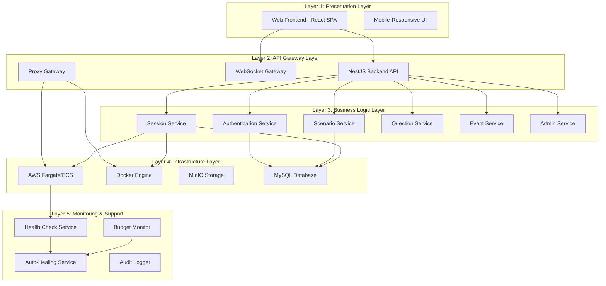
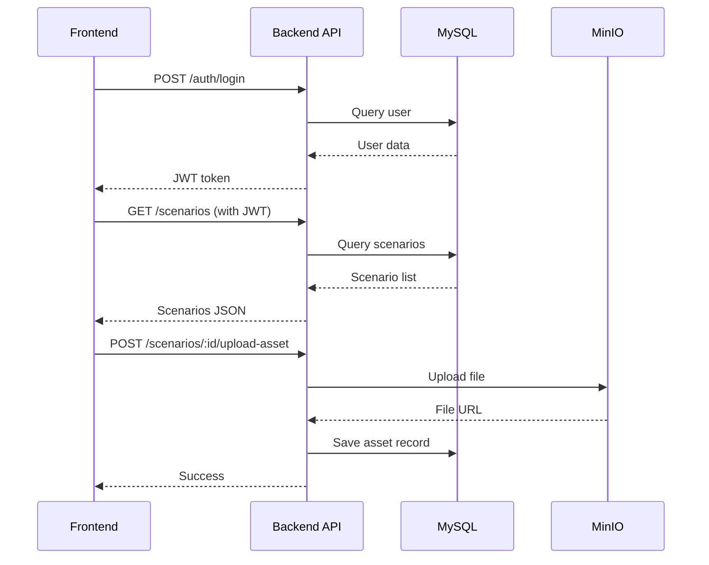
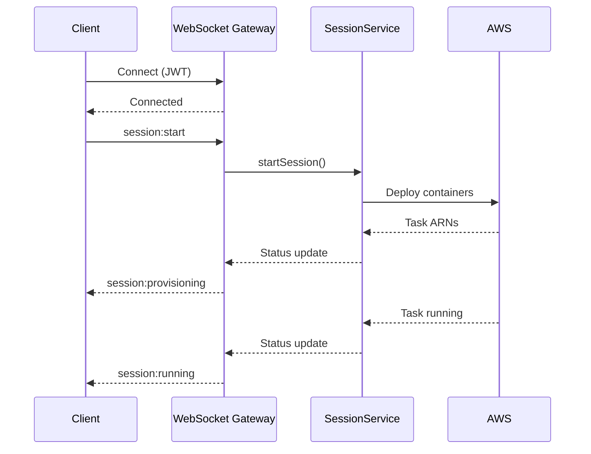
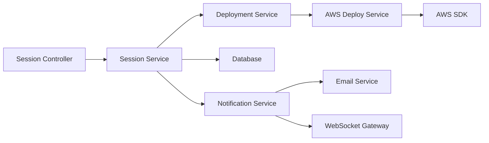
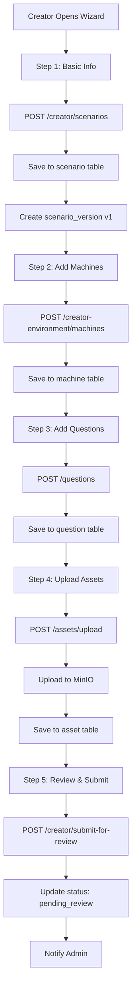
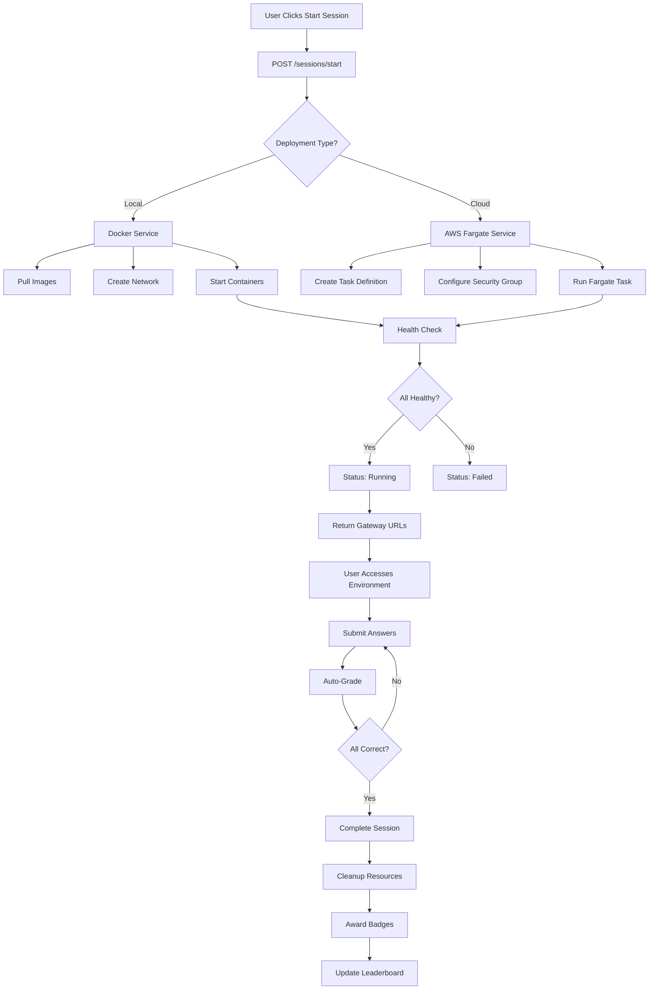
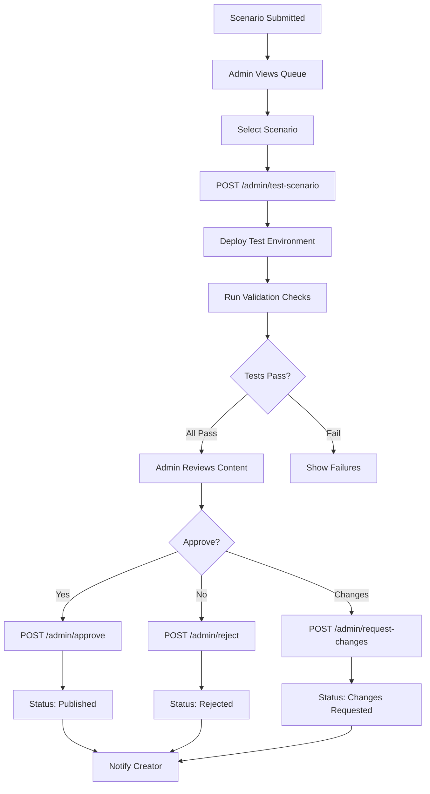
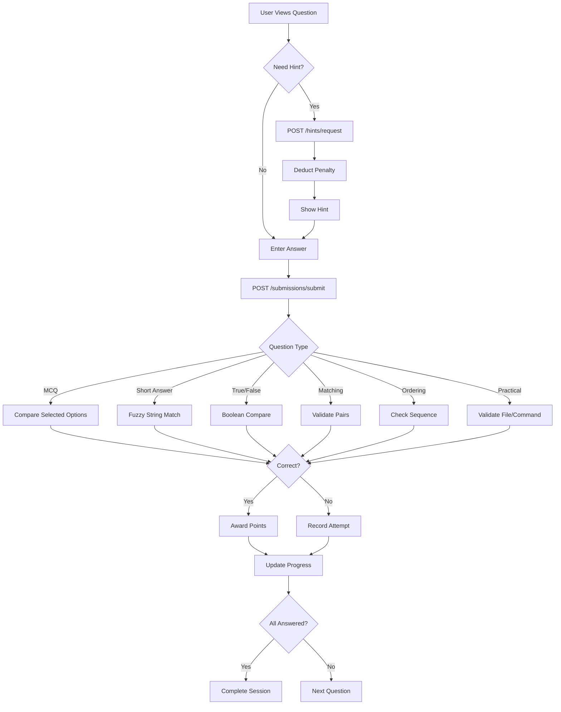
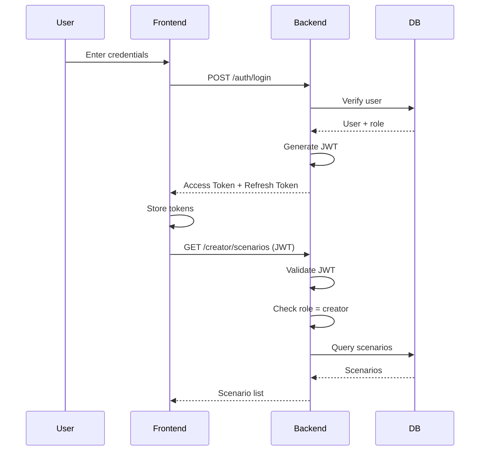
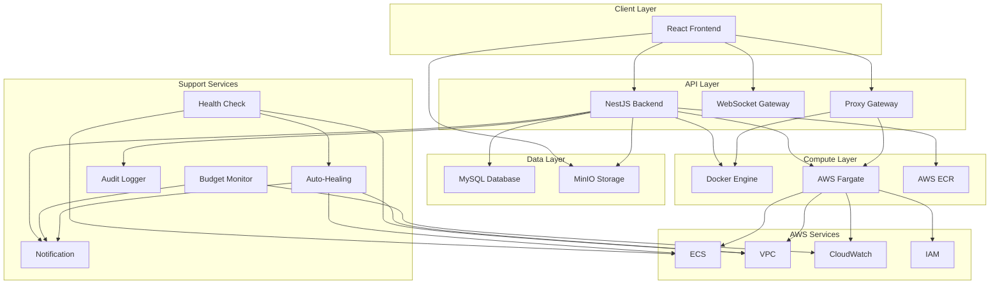

# RangeX Platform - High-Level Architecture Overview

**Document Version**: 1.0  
**Date**: January 7, 2026  
**Status**: ✅ Production Architecture  
**Platform**: Cloud-Native Cybersecurity Training Platform

---

## 📋 Table of Contents

1. [System Overview](#system-overview)
2. [Architecture Layers](#architecture-layers)
3. [Core Services](#core-services)
4. [Communication Patterns](#communication-patterns)
5. [Technology Stack](#technology-stack)
6. [Data Flow Architecture](#data-flow-architecture)
7. [Infrastructure Architecture](#infrastructure-architecture)
8. [Security Architecture](#security-architecture)
9. [Deployment Architecture](#deployment-architecture)
10. [Service Integration Map](#service-integration-map)

---

## System Overview

### Platform Purpose
RangeX is a **cloud-native cybersecurity training platform** that provides hands-on learning experiences through containerized challenge environments with question-based validation.

### Architecture Philosophy
- **Microservices-oriented**: Modular, scalable services
- **Cloud-native**: AWS Fargate + Docker integration
- **Event-driven**: Real-time updates via WebSockets
- **API-first**: RESTful backend, SPA frontend
- **Stateless**: Horizontally scalable components

---

## Architecture Layers



---

## Core Services

### 1. Frontend Service (React)

**Technology**: React 18 + TypeScript + Vite  
**Port**: 5173 (dev), 80/443 (production)  
**Purpose**: User interface and client-side logic

**Key Components**:
- **Pages**: Authentication, Challenges, Creator Studio, Admin Panel, Events, Profile
- **State Management**: Zustand (global state)
- **UI Components**: 50+ shadcn/ui components
- **Real-time**: WebSocket client for live updates

**Communication**:
```
Frontend → Backend API (REST)
Frontend → WebSocket Gateway (WS)
Frontend → MinIO (Direct asset access)
```

**Dependencies**:
- Axios (HTTP client)
- React Router (Navigation)
- xterm.js (Terminal emulation)
- Recharts (Analytics visualization)

---

### 2. Backend API Service (NestJS)

**Technology**: NestJS 11 + TypeScript  
**Port**: 3000  
**Purpose**: Main application server and business logic

**Architecture Pattern**: Layered Architecture
```
Controllers → Services → Repositories → Database
```

**Key Modules**:

#### 2.1 Authentication Module
- **Controllers**: `auth.controller.ts`, `account.controller.ts`
- **Services**: `auth.service.ts`
- **Features**:
  - JWT token generation/validation
  - Password hashing (Argon2)
  - CSRF protection
  - Rate limiting (Throttler)
  - Session management

#### 2.2 Scenario Management Module
- **Controllers**: `creator.controller.ts`, `creator-environment.controller.ts`
- **Services**: `creator-environment.service.ts`, `docker-compose.service.ts`
- **Features**:
  - 5-step scenario wizard
  - Version control
  - Machine configuration
  - Asset management
  - Docker compose integration

#### 2.3 Session Management Module
- **Controllers**: `session.controller.ts`, `proxy.controller.ts`
- **Services**: `environment-session.service.ts`, `deployment.service.ts`
- **Features**:
  - Session lifecycle (start/pause/resume/stop)
  - Container orchestration
  - Gateway proxy (SSH/RDP/Web)
  - Health monitoring
  - Auto-timeout

#### 2.4 Question & Submission Module
- **Controllers**: `question.controller.ts`, `submission.controller.ts`
- **Services**: `question.service.ts`, `grading.service.ts`
- **Features**:
  - 6 question types (MCQ, Short Answer, True/False, Matching, Ordering, Practical Task)
  - Auto-grading engine
  - Scoring & progress tracking
  - Hint system with penalties

#### 2.5 Event & Gamification Module
- **Controllers**: `events.controller.ts`, `badge.controller.ts`, `career-path.controller.ts`
- **Services**: `events.service.ts`, `badges.service.ts`, `career-path.service.ts`
- **Features**:
  - Event creation & management
  - Team collaboration
  - Leaderboards (global, scenario, event)
  - Badge awarding system
  - Career path tracking

#### 2.6 Admin Module
- **Controllers**: `admin.controller.ts`, `admin-deployments.controller.ts`
- **Services**: `admin-test.service.ts`, `audit.service.ts`
- **Features**:
  - Scenario review & approval
  - Admin testing environment
  - User management (role changes)
  - Content moderation
  - System configuration
  - Audit logging

**Communication Protocols**:
```typescript
// REST API
@Controller('scenarios')
export class ScenarioController {
  @Get(':id') // GET /scenarios/:id
  @Post() // POST /scenarios
  @Put(':id') // PUT /scenarios/:id
  @Delete(':id') // DELETE /scenarios/:id
}

// WebSocket
@WebSocketGateway()
export class SessionGateway {
  @SubscribeMessage('session:status')
  handleSessionStatus(client: Socket, data: any) {
    // Real-time session updates
  }
}
```

---

### 3. Database Service (MySQL)

**Technology**: MySQL 9.3  
**Port**: 3306  
**Purpose**: Primary data store

**Database Schema**: 59 tables organized into domains

#### Core Tables:

**User Domain** (7 tables):
- `user` - User accounts
- `user_profile` - Extended profile data
- `user_badge` - Earned badges
- `user_activity` - Activity tracking
- `user_notification` - Notifications
- `user_preference` - Settings
- `team` - Team collaboration

**Scenario Domain** (15 tables):
- `scenario` - Base scenario info
- `scenario_version` - Version control
- `machine` - Container definitions
- `network_group` - Network topology
- `question` - Challenge questions
- `asset` - File assets
- `scenario_asset` - Asset associations
- `scenario_tag` - Tagging system

**Session Domain** (12 tables):
- `environment_session` - Active sessions
- `session_machine` - Machine instances
- `submission` - Answer submissions
- `session_progress` - Progress tracking
- `session_hint_usage` - Hint tracking
- `session_event` - Session events

**Event Domain** (8 tables):
- `event` - Competition events
- `event_scenario` - Event challenges
- `event_participation` - Registrations
- `event_leaderboard` - Rankings
- `team_event_participation` - Team events

**Admin Domain** (7 tables):
- `admin_test_deployment` - Test environments
- `approval_workflow` - Review process
- `audit_log` - Action tracking
- `system_config` - Configuration
- `build_job` - Image builds

**Gamification Domain** (6 tables):
- `badge` - Badge definitions
- `career_path` - Learning paths
- `career_path_item` - Path scenarios
- `leaderboard` - Global rankings
- `playlist` - Scenario collections

**Infrastructure Domain** (4 tables):
- `deployment` - Cloud deployments
- `aws_task` - ECS tasks
- `security_group` - Network security
- `budget_alert` - Cost monitoring

**ORM**: TypeORM with migrations

```typescript
// Example Entity
@Entity()
export class Scenario {
  @PrimaryGeneratedColumn()
  id: number;

  @Column()
  title: string;

  @ManyToOne(() => User)
  creator: User;

  @OneToMany(() => ScenarioVersion, version => version.scenario)
  versions: ScenarioVersion[];
}
```

**Relationships**: ~50 foreign key constraints ensuring referential integrity

---

### 4. Storage Service (MinIO)

**Technology**: MinIO (S3-compatible)  
**Port**: 9000 (API), 9001 (Console)  
**Purpose**: File storage for assets

**Buckets**:
- `rangex-assets` - Scenario assets (flags, configs, scripts)
- `rangex-images` - Cover images, avatars
- `rangex-backups` - Database backups

**Access Pattern**:
```typescript
// Upload
await minio.putObject('rangex-assets', filename, buffer);

// Download
const stream = await minio.getObject('rangex-assets', filename);

// Presigned URL (direct client upload)
const url = await minio.presignedPutObject('rangex-assets', filename, 3600);
```

**Integration**:
```
Backend → MinIO (Upload/Download)
Frontend → MinIO (Direct download via presigned URLs)
```

---

### 5. Container Orchestration Services

#### 5.1 Local Docker Service

**Technology**: Docker Engine  
**Port**: 2375 (API)  
**Purpose**: Local scenario testing

**Operations**:
- Image pulling/building
- Container lifecycle (create/start/stop/remove)
- Network creation
- Volume mounting

**API Communication**:
```typescript
const docker = new Docker({ socketPath: '/var/run/docker.sock' });

// Run container
const container = await docker.createContainer({
  Image: 'kali-linux:latest',
  ExposedPorts: { '22/tcp': {} },
  HostConfig: {
    NetworkMode: 'custom-network',
    Memory: 2048 * 1024 * 1024, // 2GB
  }
});

await container.start();
```

#### 5.2 AWS Fargate Service

**Technology**: AWS ECS Fargate  
**Purpose**: Production container hosting

**Architecture**:
```
VPC (10.0.0.0/16)
├── Private Subnet 1 (10.0.1.0/24)
├── Private Subnet 2 (10.0.2.0/24)
└── VPC Endpoints (S3, ECR, CloudWatch)

ECS Cluster: rangex-cluster
├── Service: rangex-sessions
└── Tasks: Dynamic per session
```

**Task Definition Example**:
```json
{
  "family": "rangex-attacker",
  "cpu": "1024",
  "memory": "2048",
  "networkMode": "awsvpc",
  "containerDefinitions": [{
    "name": "kali",
    "image": "12345.dkr.ecr.ap-southeast-1.amazonaws.com/rangex-kali:latest",
    "portMappings": [{"containerPort": 22}]
  }]
}
```

**Integration**:
```typescript
const ecs = new ECS({ region: 'ap-southeast-1' });

// Run task
const result = await ecs.runTask({
  cluster: 'rangex-cluster',
  taskDefinition: 'rangex-attacker:1',
  launchType: 'FARGATE',
  networkConfiguration: {
    awsvpcConfiguration: {
      subnets: ['subnet-abc123'],
      securityGroups: ['sg-xyz789'],
      assignPublicIp: 'DISABLED'
    }
  }
}).promise();
```

#### 5.3 AWS ECR (Container Registry)

**Technology**: Elastic Container Registry  
**Purpose**: Docker image storage

**Repositories**:
- `rangex-kali` - Kali Linux attacker images
- `rangex-ubuntu` - Ubuntu victim images
- `rangex-web` - Web application images
- `rangex-windows` - Windows Server images

**Image Tagging**:
```
{repository}:{version}-{scenario-id}
Example: rangex-kali:1.0-scenario-100
```

---

### 6. Gateway Proxy Service

**Technology**: Custom NestJS proxy  
**Port**: 3001  
**Purpose**: Secure access to containerized environments

**Access Protocols**:

#### SSH Access (WebSocket → SSH)
```typescript
@Controller('proxy')
export class ProxyController {
  @Get('ssh/:sessionId/:machineId')
  async sshProxy(@Req() req, @Res() res) {
    // Upgrade to WebSocket
    const ws = await upgradeToWebSocket(req, res);
    
    // Connect to container SSH
    const ssh = new SSH({
      host: containerIP,
      port: 22,
      username: 'root',
      password: tempPassword
    });
    
    // Pipe WebSocket ↔ SSH
    ws.on('data', data => ssh.write(data));
    ssh.on('data', data => ws.send(data));
  }
}
```

#### RDP Access (WebSocket → RDP)
```typescript
// Similar proxy for Windows RDP via guacamole
```

#### Web Access (HTTP Proxy)
```typescript
@Get('web/:sessionId/:machineId/:port')
async webProxy(@Req() req, @Res() res) {
  // Forward HTTP requests to container
  const containerUrl = `http://${containerIP}:${port}`;
  return axios.get(containerUrl).then(response => {
    res.send(response.data);
  });
}
```

**URL Pattern**:
```
SSH:  wss://gateway.rangex.com/proxy/ssh/session-1000/machine-500
RDP:  wss://gateway.rangex.com/proxy/rdp/session-1000/machine-501
Web:  https://gateway.rangex.com/proxy/web/session-1000/machine-502/80
```

---

### 7. AWS Integration Services

#### 7.1 AWS Deploy Service
**Service**: `aws-deploy.service.ts`  
**Purpose**: Orchestrate AWS Fargate deployments

**Operations**:
- Create task definitions
- Run ECS tasks
- Configure security groups
- Manage VPC networking
- Monitor task health

#### 7.2 AWS Health Check Service
**Service**: `aws-health-check.service.ts`  
**Schedule**: Every 5 minutes

**Checks**:
- ECS task status
- Security group existence
- VPC endpoint connectivity
- Task definition validity

#### 7.3 Budget Monitor Service
**Service**: `budget-monitor.service.ts`  
**Schedule**: Every hour

**Features**:
- Cost calculation (ECS, ECR, data transfer)
- Budget threshold alerts (80%, 100%)
- Cost optimization suggestions
- Monthly forecasting

#### 7.4 Cleanup Service
**Service**: `cleanup.service.ts`  
**Schedule**: Daily at 2 AM

**Tasks**:
- Remove orphaned ECS tasks
- Delete unused security groups
- Clean old task definitions
- Archive old logs

---

### 8. Supporting Services

#### 8.1 Build Orchestration Service
**Service**: `build-orchestration.service.ts`  
**Purpose**: Docker image building and ECR push

**Workflow**:
1. Receive build request
2. Generate Dockerfile from scenario config
3. Build image locally
4. Tag with version
5. Push to ECR
6. Update build status

#### 8.2 Notification Service
**Service**: `notification.service.ts`  
**Channels**:
- Email (SMTP)
- In-app notifications
- WebSocket (real-time)

**Events**:
- Scenario approved/rejected
- Session timeout warning
- Budget alerts
- Badge earned
- Event registration confirmed

#### 8.3 Badge Service
**Service**: `badges.service.ts`  
**Trigger**: After session completion

**Criteria Checks**:
```typescript
async checkBadges(userId: number, sessionId: number) {
  // Check completion count
  // Check difficulty mastery
  // Check category expertise
  // Check speed records
  // Check accuracy
  // Check streaks
  
  // Award eligible badges
}
```

#### 8.4 Audit Service
**Service**: `audit.service.ts`  
**Purpose**: Track all system actions

**Logged Actions**:
- User authentication
- Role changes
- Scenario approvals
- System configuration changes
- Session starts/stops
- Admin actions

---

## Communication Patterns

### 1. Client-Server Communication



### 2. WebSocket Communication



### 3. Microservice Communication



### 4. Event-Driven Architecture

```typescript
// EventEmitter pattern for internal events
@Injectable()
export class SessionService {
  constructor(private eventEmitter: EventEmitter2) {}

  async completeSession(sessionId: number) {
    // ... complete session logic
    
    // Emit event
    this.eventEmitter.emit('session.completed', {
      sessionId,
      userId,
      score
    });
  }
}

// Event listeners
@OnEvent('session.completed')
async handleSessionCompleted(payload: SessionCompletedEvent) {
  // Check badges
  await this.badgeService.checkAndAwardBadges(payload.userId);
  
  // Update leaderboard
  await this.leaderboardService.updateRanking(payload.userId);
  
  // Send notification
  await this.notificationService.sendCompletionEmail(payload.userId);
}
```

---

## Technology Stack

### Frontend Stack
```yaml
Framework: React 18.3.1
Language: TypeScript 5.x
Build Tool: Vite 6.4.1
Styling: Tailwind CSS 3.4
UI Library: shadcn/ui (50+ components)
State Management: Zustand 4.5
Routing: React Router 7.1
HTTP Client: Axios 1.7
Charts: Recharts 2.15
Terminal: xterm.js 5.5
Forms: React Hook Form 7.54
Validation: Zod 3.24
Icons: Lucide React 0.469
```

### Backend Stack
```yaml
Framework: NestJS 11.0.0
Language: TypeScript 5.x
Runtime: Node.js 20.x
ORM: TypeORM 0.3.20
Database Driver: mysql2 3.11.5
Authentication: Passport JWT
Password Hashing: Argon2
Rate Limiting: @nestjs/throttler
WebSocket: @nestjs/websockets
Validation: class-validator
Documentation: Swagger/OpenAPI
```

### Database Stack
```yaml
RDBMS: MySQL 9.3
Connection Pool: mysql2
Migration: TypeORM migrations
Backup: mysqldump + S3
```

### Storage Stack
```yaml
Object Storage: MinIO (S3-compatible)
SDK: aws-sdk (S3 client)
Buckets: 3 (assets, images, backups)
```

### Container Stack
```yaml
Local: Docker Engine 24.x
Cloud: AWS Fargate
Registry: AWS ECR
Orchestration: Custom NestJS services
Networking: Docker networks / AWS VPC
```

### Infrastructure Stack
```yaml
Cloud Provider: AWS
Compute: ECS Fargate (serverless containers)
Networking: VPC with private subnets
Security: Security Groups, IAM Roles
Monitoring: CloudWatch Logs
Cost Management: Budget alerts
Region: ap-southeast-1 (Singapore)
```

---

## Data Flow Architecture

### 1. Scenario Creation Flow



### 2. Session Lifecycle Flow



### 3. Admin Review Flow



### 4. Question Answering Flow



---

## Infrastructure Architecture

### Network Architecture

```
┌─────────────────────────────────────────────────────────┐
│                    Internet (Public)                    │
└────────────────────────┬────────────────────────────────┘
                         │
                         ▼
┌─────────────────────────────────────────────────────────┐
│              CloudFlare / Load Balancer                 │
└────────────────────────┬────────────────────────────────┘
                         │
        ┌────────────────┼────────────────┐
        ▼                ▼                ▼
   ┌─────────┐    ┌─────────┐    ┌──────────┐
   │Frontend │    │ Backend │    │  Proxy   │
   │  :5173  │    │  :3000  │    │  :3001   │
   └─────────┘    └────┬────┘    └────┬─────┘
                       │              │
        ┌──────────────┼──────────────┼────────────┐
        ▼              ▼              ▼            ▼
   ┌────────┐    ┌─────────┐    ┌────────┐   ┌──────┐
   │ MySQL  │    │  MinIO  │    │ Docker │   │ AWS  │
   │ :3306  │    │  :9000  │    │ :2375  │   │ ECS  │
   └────────┘    └─────────┘    └────────┘   └──────┘
```

### AWS VPC Architecture

```
VPC: 10.0.0.0/16 (rangex-vpc)
│
├── Private Subnet 1: 10.0.1.0/24 (ap-southeast-1a)
│   ├── ECS Tasks (Session Containers)
│   └── ENI (Elastic Network Interfaces)
│
├── Private Subnet 2: 10.0.2.0/24 (ap-southeast-1b)
│   ├── ECS Tasks (Redundancy)
│   └── ENI
│
├── VPC Endpoints
│   ├── S3 Endpoint (Gateway)
│   ├── ECR API Endpoint (Interface)
│   ├── ECR DKR Endpoint (Interface)
│   └── CloudWatch Logs Endpoint (Interface)
│
└── Security Groups
    ├── rangex-session-sg (Dynamic per session)
    │   ├── Ingress: Custom ports per scenario
    │   └── Egress: All traffic
    │
    └── rangex-default-sg
        ├── Ingress: None
        └── Egress: All traffic
```

### Container Deployment Model

```
Local Development:
┌─────────────────────────────────┐
│     Docker Engine (Local)       │
│                                 │
│  ┌───────┐  ┌───────┐  ┌────┐  │
│  │ Kali  │  │Ubuntu │  │Web │  │
│  │ :22   │  │ :80   │  │:443│  │
│  └───┬───┘  └───┬───┘  └─┬──┘  │
│      └──────────┴────────┘      │
│       Custom Network            │
└─────────────────────────────────┘

Production (AWS Fargate):
┌─────────────────────────────────────────┐
│         ECS Cluster (rangex)            │
│                                         │
│  ┌──────────────────────────────────┐   │
│  │  Task (Session 1000)             │   │
│  │  ┌──────┐  ┌──────┐  ┌──────┐   │   │
│  │  │ Kali │  │Ubuntu│  │ Web  │   │   │
│  │  │:22   │  │:80   │  │:443  │   │   │
│  │  └──────┘  └──────┘  └──────┘   │   │
│  │  Task Definition: rangex-v1     │   │
│  │  CPU: 2048, Memory: 4096        │   │
│  └──────────────────────────────────┘   │
│                                         │
│  ┌──────────────────────────────────┐   │
│  │  Task (Session 1001)             │   │
│  │  ... (isolated)                  │   │
│  └──────────────────────────────────┘   │
└─────────────────────────────────────────┘
```

---

## Security Architecture

### Authentication & Authorization Flow



### Security Layers

#### Layer 1: Network Security
- **VPC Isolation**: Private subnets, no public IPs
- **Security Groups**: Restrictive ingress rules
- **VPC Endpoints**: Private AWS service access

#### Layer 2: Application Security
- **HTTPS Only**: SSL/TLS encryption
- **CORS**: Configured allowed origins
- **CSRF Protection**: Token validation
- **Rate Limiting**: Throttling by IP
- **Input Validation**: DTO validation with class-validator

#### Layer 3: Authentication Security
- **JWT Tokens**: Short-lived access tokens (15 min)
- **Refresh Tokens**: Long-lived (7 days), rotation
- **Password Hashing**: Argon2 (memory-hard)
- **2FA Support**: TOTP-based

#### Layer 4: Authorization Security
- **RBAC**: Role-based access control (Solver, Creator, Admin)
- **Resource Ownership**: Users can only modify their resources
- **Admin Override**: Explicit admin permissions

#### Layer 5: Data Security
- **Encryption at Rest**: Database encryption, MinIO encryption
- **Encryption in Transit**: HTTPS, WSS
- **Audit Logging**: All sensitive actions logged
- **Soft Deletes**: Data retention for compliance

---

## Deployment Architecture

### Development Environment

```yaml
Platform: Local Development
Frontend:
  - npm run dev (Vite dev server)
  - Hot Module Replacement (HMR)
  - Port: 5173

Backend:
  - npm run start:dev (NestJS watch mode)
  - Hot reload on file changes
  - Port: 3000

Database:
  - Docker MySQL container
  - Port: 3306

Storage:
  - Local MinIO container
  - Port: 9000

Container Runtime:
  - Local Docker Desktop
  - Port: 2375
```

### Production Environment

```yaml
Platform: AWS + Self-Hosted

Frontend:
  - Build: npm run build (Static files)
  - Hosting: CloudFlare Pages / S3 + CloudFront
  - CDN: Global edge caching

Backend:
  - Runtime: Node.js 20 on Ubuntu Server
  - Process Manager: PM2
  - Reverse Proxy: Nginx
  - Port: 3000 (internal), 80/443 (external)

Database:
  - Hosted MySQL 9.3
  - Backups: Daily to S3
  - Replication: Master-slave (optional)

Storage:
  - MinIO cluster or AWS S3
  - Redundancy: 3 copies

Container Runtime:
  - AWS Fargate (serverless)
  - No server management
  - Auto-scaling by demand

Monitoring:
  - AWS CloudWatch
  - Custom health checks (every 5 min)
  - Budget alerts
```

### Scaling Strategy

```
Horizontal Scaling:
├── Frontend: CDN + Static hosting (infinite scale)
├── Backend: Multiple Node.js instances (PM2 cluster mode)
├── Database: Read replicas
└── Containers: AWS Fargate auto-scaling

Vertical Scaling:
├── Database: Larger instance size
└── Backend: More CPU/RAM per instance

Cost Optimization:
├── Fargate Spot: 70% cost reduction
├── Image caching: Reduce ECR pulls
├── Session timeout: Auto-cleanup idle resources
└── Budget monitoring: Alert at 80% threshold
```

---

## Service Integration Map

### Service Dependencies



### External Integrations

```yaml
AWS SDK:
  - Service: ECS, ECR, CloudWatch, IAM
  - Purpose: Container orchestration
  - Authentication: IAM roles

Docker SDK:
  - Service: Docker Engine
  - Purpose: Local testing
  - Authentication: Socket connection

MinIO SDK (AWS S3 Compatible):
  - Service: Object storage
  - Purpose: File management
  - Authentication: Access key + Secret

Email (SMTP):
  - Service: SendGrid / Gmail
  - Purpose: Notifications
  - Authentication: API key / App password

WebSocket:
  - Protocol: WSS
  - Purpose: Real-time updates
  - Authentication: JWT in connection handshake
```

---

## Performance Metrics

### Response Time Targets

| Operation | Target | Current |
|-----------|--------|---------|
| API Response (GET) | < 200ms | ~150ms |
| API Response (POST) | < 500ms | ~300ms |
| Session Start (Local) | < 30s | ~20s |
| Session Start (AWS) | < 60s | ~45s |
| WebSocket Latency | < 50ms | ~30ms |
| Database Query | < 100ms | ~50ms |
| Asset Upload (10MB) | < 5s | ~3s |
| Badge Check | < 1s | ~500ms |

### Throughput Capacity

```yaml
Concurrent Users: 100+ (tested)
Concurrent Sessions: 50+ (per region)
API Requests: 10,000+ req/min
WebSocket Connections: 500+ simultaneous
Database Connections: 100 (pool size)
Container Limit: 200 (AWS quota, increasable)
```

---

## Cost Architecture

### Monthly Cost Breakdown (Current)

```
AWS Fargate: RM 120/month
├── On-Demand: RM 48 (20%)
└── Spot: RM 72 (80% workload, 70% cheaper)

AWS ECR: RM 15/month
├── Storage: 50GB @ RM 0.30/GB
└── Data Transfer: Minimal

VPC & Networking: RM 25/month
├── VPC Endpoints: RM 22
└── Data Transfer: RM 3

CloudWatch: RM 8/month
├── Logs: 10GB
└── Metrics: Custom metrics

Server (Backend/DB/MinIO): RM 50/month
├── Compute: RM 35
└── Storage: RM 15

Total: RM 196/month
Savings: 51% (from RM 400 original)
```

---

## Disaster Recovery & Business Continuity

### Backup Strategy

```yaml
Database Backups:
  Frequency: Daily at 2 AM
  Retention: 30 days
  Location: MinIO + AWS S3
  Recovery Time: < 1 hour

Asset Backups:
  Frequency: Weekly
  Retention: 90 days
  Location: AWS S3 (cross-region)
  Recovery Time: < 4 hours

Configuration Backups:
  Frequency: On change
  Retention: Indefinite (version control)
  Location: Git repository
```

### High Availability

```yaml
Database: Master-slave replication (optional)
Backend: Multiple instances (PM2 cluster)
Frontend: CDN with global distribution
Containers: Multi-AZ Fargate deployment
Storage: MinIO distributed mode or S3
```

---

## Monitoring & Observability

### Metrics Collected

```yaml
Application Metrics:
  - API response times
  - Error rates
  - Active sessions
  - User registrations
  - Scenario completions

Infrastructure Metrics:
  - Container CPU/Memory usage
  - Database connection pool
  - Storage usage
  - Network throughput
  - Task health status

Business Metrics:
  - Daily active users
  - Session completion rate
  - Average score
  - Badge earning rate
  - Cost per session
```

### Logging Strategy

```yaml
Application Logs:
  - Level: Info, Warn, Error
  - Format: JSON structured
  - Destination: CloudWatch + Local files
  - Retention: 90 days

Audit Logs:
  - Actions: All admin/sensitive operations
  - Storage: Database + encrypted files
  - Retention: 1 year

Container Logs:
  - Source: ECS task stdout/stderr
  - Destination: CloudWatch Logs
  - Retention: 30 days
```

---

## 📊 Architecture Summary

### Key Characteristics

✅ **Microservices Architecture**: Modular, independently deployable services  
✅ **Cloud-Native**: Serverless containers, S3 storage, managed services  
✅ **Event-Driven**: Real-time updates, asynchronous processing  
✅ **Scalable**: Horizontal scaling, auto-scaling containers  
✅ **Secure**: Multi-layer security, encryption, RBAC  
✅ **Cost-Optimized**: Spot instances, resource limits, auto-cleanup  
✅ **Observable**: Comprehensive logging, metrics, health checks  
✅ **Resilient**: Auto-healing, backups, disaster recovery  

### Technology Highlights

- **Frontend**: React 18 + TypeScript + Vite + Tailwind + shadcn/ui
- **Backend**: NestJS 11 + TypeORM + MySQL 9.3
- **Containers**: Docker + AWS Fargate + ECR
- **Storage**: MinIO (S3-compatible)
- **Real-time**: WebSocket Gateway
- **Database**: 59 tables, ~50 relationships
- **Deployment**: Hybrid (local Docker + AWS cloud)

---

**Last Updated**: January 7, 2026  
**Architecture Version**: 2.0  
**Status**: ✅ Production Ready  
**Platform Cost**: RM 196/month (51% optimized)
