# RangeX Complete Sequence Diagrams

**Document Version**: 1.0  
**Date**: January 6, 2026  
**Status**: Production Ready

---

## 📋 Table of Contents

1. [User Authentication & Registration](#1-user-authentication--registration)
2. [Scenario Creation Workflow (Creator)](#2-scenario-creation-workflow-creator)
3. [Challenge Session Launch (Solver)](#3-challenge-session-launch-solver)
4. [Docker Container Deployment](#4-docker-container-deployment)
5. [AWS Fargate Deployment](#5-aws-fargate-deployment)
6. [Event Participation Flow](#6-event-participation-flow)
7. [Team Collaboration](#7-team-collaboration)
8. [Admin Approval Workflow](#8-admin-approval-workflow)
9. [Testing & Validation](#9-testing--validation)
10. [Monitoring & Auto-Healing](#10-monitoring--auto-healing)
11. [Badge & Gamification](#11-badge--gamification)
12. [Learning Path Progression](#12-learning-path-progression)

---

## 1. User Authentication & Registration

### 1.1 User Registration Flow

**Key Steps:**
1. Frontend validates email format and password strength (min 8 chars, uppercase, lowercase, number)
2. Backend checks email uniqueness in database
3. Password hashed using Argon2 (memory-hard algorithm, more secure than bcrypt)
4. User record created with default roles (solver: true, creator: false, admin: false)
5. JWT tokens generated (access token: 1h, refresh token: 7d)
6. Welcome email sent asynchronously
7. User redirected to dashboard

---

### 1.2 Login with 2FA Flow

**Security Features:**
- Argon2 password hashing (OWASP recommended)
- TOTP-based 2FA (Time-based One-Time Password)
- IP address tracking for audit
- Rate limiting on login attempts
- Refresh token rotation
- JWT token expiration

---

## 2. Scenario Creation Workflow (Creator)

### 2.1 Complete Scenario Creation (5-Step Wizard)

**Question Types Supported (6 types):**
1. **Multiple Choice (MCQ)** - Single or multi-select with auto-grading
2. **Short Answer** - Free text with fuzzy matching validation
3. **True/False** - Binary choice questions
4. **Matching** - Pair items from two columns
5. **Ordering** - Arrange items in correct sequence
6. **Practical Task** - File/command output validation

---

### 2.2 Docker Compose Auto-Sync

**Auto-Sync Features:**
- Parses docker-compose.yml structure
- Extracts services, images, ports, environment variables
- Maps network configuration to security groups
- Automatically creates/updates machine records
- Preserves manual configurations when possible

---

## 3. Challenge Session Launch (Solver)

### 3.1 Standard Challenge Session Flow

```mermaid
sequenceDiagram
    actor Solver
    participant Frontend
    participant SessionController
    participant SessionService
    participant DeploymentService
    participant AWSService
    participant Database
    participant WebSocket

    Solver->>Frontend: Click "Start Challenge"
    Frontend->>SessionController: POST /sessions/start
    
    SessionController->>SessionService: createSession(userId, scenarioVersionId)
    SessionService->>Database: Check concurrent session limits
    
    alt Limit Exceeded
        SessionService-->>Frontend: 409 Conflict - Max sessions reached
        Frontend-->>Solver: Error: You have too many active sessions
    else Within Limits
        SessionService->>Database: INSERT INTO environment_session (status: provisioning)
        Database-->>SessionService: session.id
        
        SessionService->>DeploymentService: deployEnvironment(sessionId)
        
        par Parallel Deployment
            DeploymentService->>AWSService: Create ECS tasks
            DeploymentService->>AWSService: Configure security groups
            DeploymentService->>AWSService: Setup network topology
        end
        
        loop For each machine
            AWSService->>AWSService: Launch Fargate task
            AWSService->>Database: INSERT INTO environment_machine
            AWSService-->>DeploymentService: Task ARN
        end
        
        DeploymentService->>DeploymentService: Wait for all tasks RUNNING
        DeploymentService->>Database: UPDATE environment_session SET status = 'running'
        
        DeploymentService->>WebSocket: emit('session-ready', sessionId)
        WebSocket-->>Frontend: Session ready event
        
        Frontend->>Frontend: Enable terminal access
        Frontend->>Frontend: Start session timer
        Frontend-->>Solver: Environment ready! Happy hacking 🚀
    end
```

**Session States:**
1. **provisioning** - Infrastructure being created
2. **running** - Active and accessible
3. **paused** - Temporarily stopped (cost saving)
4. **stopping** - Graceful shutdown in progress
5. **stopped** - Completed or terminated
6. **failed** - Deployment error

---

### 3.2 Answer Submission & Auto-Grading

```mermaid
sequenceDiagram
    actor Solver
    participant Frontend
    participant SessionController
    participant ValidationService
    participant ScoringService
    participant Database
    participant WebSocket

    Solver->>Frontend: Submit answer
    Frontend->>SessionController: POST /sessions/:id/submit-answer
    
    SessionController->>ValidationService: validateAnswer(questionId, answer)
    
    alt MCQ or True/False
        ValidationService->>ValidationService: Compare with correct answer
        ValidationService-->>SessionController: { correct: true, points: 10 }
    else Short Answer
        ValidationService->>ValidationService: Fuzzy match with accepted answers
        ValidationService->>ValidationService: Check regex patterns
        ValidationService-->>SessionController: { correct: true, points: 15 }
    else Practical Task
        ValidationService->>ValidationService: Execute validation script
        ValidationService->>ValidationService: Check file/command output
        ValidationService-->>SessionController: { correct: false, points: 0 }
    end
    
    SessionController->>ScoringService: updateScore(sessionId, points)
    ScoringService->>Database: UPDATE environment_session SET answers, score
    
    ScoringService->>ScoringService: Check completion criteria
    
    alt All Questions Answered
        ScoringService->>Database: UPDATE status = 'completed'
        ScoringService->>WebSocket: emit('challenge-completed', data)
        WebSocket-->>Frontend: Challenge completed!
        Frontend-->>Solver: 🎉 Congratulations! Score: 95/100
    else Partial Completion
        ScoringService-->>Frontend: { correct: true, score: 45/100 }
        Frontend-->>Solver: ✅ Correct! +15 points
    end
```

**Validation Types:**
- **Exact Match** - Case-sensitive string comparison
- **Fuzzy Match** - Levenshtein distance < threshold
- **Regex Pattern** - Multiple acceptable formats
- **Range Check** - Numeric answers within tolerance
- **File Validation** - SHA256 checksum or content check
- **Command Output** - Execute and compare stdout

---

## 4. Docker Container Deployment

### 4.1 Local Docker Testing Flow

**Docker Testing Features:**
- Isolated network per test
- Automatic cleanup after timeout
- Container health checks
- Resource monitoring
- Port mapping validation
- Log collection

---

## 5. AWS Fargate Deployment

### 5.1 Production Deployment to AWS ECS

```mermaid
sequenceDiagram
    actor Admin
    participant Frontend
    participant DeploymentController
    participant ECRService
    participant ECSService
    participant VPCService
    participant Database

    Admin->>Frontend: Click "Deploy to Production"
    Frontend->>DeploymentController: POST /deployments/fargate
    
    DeploymentController->>Database: INSERT INTO deployment_environment (status: building)
    
    Note over Admin,Database: Phase 1: Push Images to ECR
    DeploymentController->>ECRService: createRepositories(scenarioId)
    ECRService->>ECRService: Create ECR repos for each machine
    
    loop For each machine image
        ECRService->>ECRService: Tag local image
        ECRService->>ECRService: docker push to ECR
        ECRService->>Database: UPDATE machine SET ecrUri, ecrDigest
    end
    
    Note over Admin,Database: Phase 2: Create Task Definitions
    DeploymentController->>ECSService: createTaskDefinitions(machines)
    
    loop For each machine
        ECSService->>ECSService: Build task definition JSON
        ECSService->>ECSService: ecs:RegisterTaskDefinition
        ECSService->>Database: UPDATE machine SET taskDefinitionArn
    end
    
    Note over Admin,Database: Phase 3: Setup Networking
    DeploymentController->>VPCService: setupSessionNetwork(sessionId)
    VPCService->>VPCService: Create security groups
    VPCService->>VPCService: Configure ingress/egress rules
    VPCService->>Database: INSERT INTO session_security_groups
    
    Note over Admin,Database: Phase 4: Launch Tasks
    DeploymentController->>ECSService: launchTasks(taskDefinitions)
    
    loop For each machine
        ECSService->>ECSService: ecs:RunTask (Fargate SPOT)
        ECSService->>Database: INSERT INTO environment_machine
        ECSService->>Database: INSERT INTO session_network_topology
    end
    
    ECSService->>ECSService: Wait for tasks RUNNING
    ECSService->>Database: UPDATE deployment_environment SET status = 'active'
    
    DeploymentController-->>Frontend: { deploymentId, gatewayEndpoint }
    Frontend-->>Admin: ✅ Deployed to AWS Fargate
```

**AWS Integration:**
- ECR for private container registry
- ECS Fargate for serverless containers
- VPC with private subnets
- Security groups for network isolation
- CloudWatch for logging
- Fargate SPOT for 70% cost reduction

---

### 5.2 Gateway Proxy Setup

**Gateway Proxy Features:**
- Single entry point for all container access
- JWT-based authentication
- WebSocket for real-time communication
- SSH/RDP protocol support
- Activity tracking and idle detection
- Automatic session cleanup

---

## 6. Event Participation Flow

### 6.1 Event Registration & Participation

```mermaid
sequenceDiagram
    actor User
    participant Frontend
    participant EventController
    participant EventService
    participant TeamService
    participant Database
    participant EmailService

    Note over User,Database: Phase 1: Event Registration
    User->>Frontend: Browse events
    Frontend->>EventController: GET /events?status=upcoming
    EventController->>Database: SELECT * FROM event WHERE startDate > NOW()
    Database-->>Frontend: List of events
    
    User->>Frontend: Click "Register for Event"
    Frontend->>EventController: POST /events/:id/register
    
    EventController->>EventService: registerUser(eventId, userId)
    EventService->>Database: SELECT * FROM event WHERE id = ?
    Database-->>EventService: Event details
    
    EventService->>EventService: Check registration deadline
    EventService->>EventService: Check max participants
    
    alt Registration Closed
        EventService-->>Frontend: 403 Forbidden - Registration closed
    else Already Registered
        EventService-->>Frontend: 409 Conflict - Already registered
    else Registration Success
        EventService->>Database: INSERT INTO event_registration
        EventService->>Database: INSERT INTO event_participation (rank: NULL)
        
        EventService->>EmailService: sendRegistrationConfirmation(email)
        EventService-->>Frontend: Registration successful
        Frontend-->>User: ✅ Registered for CyberSec CTF 2026
    end
    
    Note over User,Database: Phase 2: Team Formation (Optional)
    User->>Frontend: Create/Join team
    Frontend->>TeamService: POST /teams/join-event
    
    TeamService->>Database: UPDATE event_participation SET teamId = ?
    TeamService->>Database: INSERT INTO team_member
    TeamService-->>Frontend: Team joined
    
    Note over User,Database: Phase 3: Event Start
    EventService->>EventService: Cron job checks event start time
    EventService->>Database: SELECT * FROM event WHERE startDate <= NOW()
    
    loop For each starting event
        EventService->>Database: UPDATE event SET status = 'active'
        EventService->>EmailService: notifyParticipants(eventId)
    end
    
    EmailService-->>User: 📧 Event has started! Join now!
    
    Note over User,Database: Phase 4: Challenge Completion
    User->>Frontend: Start event challenge
    Frontend->>EventController: POST /events/:id/start-challenge
    
    EventController->>EventService: createEventSession(participationId, scenarioId)
    EventService->>Database: INSERT INTO event_sessions (mode: event)
    EventService->>Database: INSERT INTO environment_session (eventId: ...)
    
    User->>Frontend: Complete challenges
    Frontend->>EventController: Submit answers
    EventController->>EventService: updateEventScore(sessionId, points)
    
    EventService->>Database: UPDATE event_sessions SET score, progressPct
    EventService->>Database: UPDATE event_participation SET totalPoints
    
    Note over User,Database: Phase 5: Leaderboard Update
    EventService->>EventService: Recalculate rankings
    EventService->>Database: UPDATE event_participation SET rank ORDER BY totalPoints DESC
    
    EventService-->>Frontend: { rank: 5, totalPoints: 850 }
    Frontend-->>User: 🏆 You're ranked #5!
```

**Event Features:**
- Individual or team participation
- Real-time leaderboard
- Time-bound challenges
- Automatic scoring
- Email notifications
- Certificate generation

---

## 7. Team Collaboration

### 7.1 Team Creation & Management

```mermaid
sequenceDiagram
    actor Leader
    actor Member
    participant Frontend
    participant TeamController
    participant TeamService
    participant Database
    participant NotificationService

    Leader->>Frontend: Create team
    Frontend->>TeamController: POST /teams
    
    TeamController->>TeamService: createTeam(name, description, leader)
    TeamService->>Database: INSERT INTO team (ownerUserId, leaderId)
    Database-->>TeamService: team.id
    
    TeamService->>Database: INSERT INTO team_member (userId, role: leader)
    TeamService-->>Frontend: Team created
    
    Note over Leader,Database: Team Member Invitation
    Leader->>Frontend: Invite member
    Frontend->>TeamController: POST /teams/:id/invite
    
    TeamController->>TeamService: inviteMember(teamId, userId)
    TeamService->>NotificationService: sendInvitation(userId, teamId)
    
    NotificationService->>Database: INSERT INTO notification (type: team_invite)
    NotificationService-->>Member: 📧 You're invited to join team!
    
    Note over Leader,Database: Member Join Request
    Member->>Frontend: Request to join
    Frontend->>TeamController: POST /teams/:id/join-request
    
    TeamController->>TeamService: createJoinRequest(teamId, userId)
    TeamService->>Database: INSERT INTO team_join_request (status: pending)
    
    TeamService->>NotificationService: notifyLeader(leaderId, requestId)
    NotificationService-->>Leader: 📧 New join request
    
    Leader->>Frontend: Review request
    Leader->>Frontend: Click "Approve"
    Frontend->>TeamController: PUT /teams/join-requests/:id/approve
    
    TeamController->>TeamService: approveJoinRequest(requestId)
    TeamService->>Database: UPDATE team_join_request SET status = 'approved'
    TeamService->>Database: INSERT INTO team_member (role: member)
    
    TeamService->>NotificationService: notifyMember(userId)
    NotificationService-->>Member: ✅ Welcome to the team!
```

**Team Features:**
- Team creation and ownership
- Role-based permissions (owner, leader, member)
- Join request workflow
- Team badges and achievements
- Shared progress tracking
- Team-based events

---

## 8. Admin Approval Workflow

### 8.1 Scenario Review & Approval

```mermaid
sequenceDiagram
    actor Creator
    actor Admin
    participant Frontend
    participant AdminController
    participant TestingService
    participant ApprovalService
    participant Database
    participant NotificationService

    Note over Creator,Database: Creator Submits for Review
    Creator->>Frontend: Submit scenario
    Frontend->>AdminController: POST /scenarios/:id/submit
    AdminController->>Database: UPDATE scenario_version SET status = 'pending_review'
    
    AdminController->>NotificationService: notifyAdmins(scenarioId)
    NotificationService-->>Admin: 📧 New scenario pending review
    
    Note over Creator,Database: Admin Testing Phase
    Admin->>Frontend: Open admin panel
    Frontend->>AdminController: GET /admin/scenarios?status=pending_review
    AdminController->>Database: SELECT * FROM scenario_version WHERE status = ?
    Database-->>Frontend: List of pending scenarios
    
    Admin->>Frontend: Click "Test Scenario"
    Frontend->>AdminController: POST /admin/test-scenario/:id
    
    AdminController->>TestingService: runAdminTest(scenarioVersionId, adminId)
    TestingService->>Database: INSERT INTO scenario_version_admin_test (status: running)
    
    TestingService->>TestingService: Deploy test environment
    TestingService->>TestingService: Run automated validations
    
    loop For each machine
        TestingService->>TestingService: Check SSH/RDP connectivity
        TestingService->>Database: INSERT INTO admin_test_validation (checkType: connectivity)
        
        TestingService->>TestingService: Check port accessibility
        TestingService->>Database: INSERT INTO admin_test_validation (checkType: ports)
        
        TestingService->>TestingService: Verify resource limits
        TestingService->>Database: INSERT INTO admin_test_validation (checkType: resources)
    end
    
    TestingService->>TestingService: Run scenario questions
    TestingService->>Database: UPDATE scenario_version_admin_test SET reportJson
    
    TestingService-->>Frontend: Test completed
    Frontend-->>Admin: Test report available
    
    Note over Creator,Database: Admin Decision
    Admin->>Frontend: Review test results
    Admin->>Frontend: Add feedback/comments
    
    alt Approve Scenario
        Admin->>Frontend: Click "Approve"
        Frontend->>AdminController: POST /admin/scenarios/:id/approve
        
        AdminController->>ApprovalService: approveScenario(versionId, adminId)
        ApprovalService->>Database: UPDATE scenario_version SET status = 'published'
        ApprovalService->>Database: UPDATE scenario SET isPublished = true
        
        ApprovalService->>NotificationService: notifyCreator(userId, 'approved')
        NotificationService-->>Creator: ✅ Your scenario was approved!
        
    else Request Changes
        Admin->>Frontend: Click "Request Changes"
        Frontend->>AdminController: POST /admin/scenarios/:id/request-changes
        
        AdminController->>ApprovalService: requestChanges(versionId, feedback)
        ApprovalService->>Database: UPDATE scenario_version SET status = 'changes_requested'
        
        ApprovalService->>NotificationService: notifyCreator(userId, 'changes_requested')
        NotificationService-->>Creator: ⚠️ Changes requested on your scenario
        
    else Reject Scenario
        Admin->>Frontend: Click "Reject"
        Frontend->>AdminController: POST /admin/scenarios/:id/reject
        
        AdminController->>ApprovalService: rejectScenario(versionId, reason)
        ApprovalService->>Database: UPDATE scenario_version SET status = 'rejected'
        
        ApprovalService->>NotificationService: notifyCreator(userId, 'rejected')
        NotificationService-->>Creator: ❌ Your scenario was rejected
    end
```

**Approval Workflow States:**
1. **draft** - Creator still editing
2. **pending_review** - Submitted, waiting for admin
3. **under_review** - Admin actively testing
4. **changes_requested** - Needs creator updates
5. **approved** - Passed review, not yet published
6. **published** - Live and accessible to solvers
7. **rejected** - Did not meet requirements

---

## 9. Testing & Validation

### 9.1 Automated Testing Pipeline

**Automated Tests:**
- **Connectivity Tests** - SSH/RDP/Web access
- **Question Validation** - Auto-grading correctness
- **Resource Tests** - CPU/memory/disk limits
- **Network Tests** - Security group rules
- **Performance Tests** - Load time, response time
- **Security Scans** - Vulnerability checks

---

## 10. Monitoring & Auto-Healing

### 10.1 AWS Health Monitoring & Auto-Healing

**Monitoring Features:**
- ECS task health monitoring
- Budget tracking and alerts
- Orphaned resource detection
- Security group validation
- VPC endpoint connectivity
- CloudWatch metrics integration
- Automatic healing for common issues

---

## 11. Badge & Gamification

### 11.1 Badge Earning Flow

```mermaid
sequenceDiagram
    actor User
    participant Frontend
    participant SessionService
    participant BadgeService
    participant Database
    participant NotificationService

    Note over User,Database: User Completes Challenge
    User->>Frontend: Submit final answer
    Frontend->>SessionService: POST /sessions/:id/submit-answer
    
    SessionService->>SessionService: Validate answer (correct!)
    SessionService->>Database: UPDATE environment_session SET score, status = 'completed'
    
    SessionService->>BadgeService: checkBadgeEligibility(userId, scenarioId)
    
    BadgeService->>Database: SELECT * FROM badge_requirement WHERE scenarioId = ?
    Database-->>BadgeService: List of badge requirements
    
    loop For each badge
        BadgeService->>BadgeService: Check requirement criteria
        
        alt First Challenge Completed
            BadgeService->>Database: SELECT COUNT(*) FROM environment_session WHERE userId = ? AND status = 'completed'
            Database-->>BadgeService: count = 1
            BadgeService->>BadgeService: Badge: "First Steps" earned!
            
        else 10 Challenges Completed
            BadgeService->>Database: SELECT COUNT(*) ...
            Database-->>BadgeService: count = 10
            BadgeService->>BadgeService: Badge: "Dedicated Learner" earned!
            
        else Hard Difficulty Completed
            BadgeService->>Database: SELECT difficulty FROM scenario_version WHERE id = ?
            Database-->>BadgeService: difficulty = 'hard'
            BadgeService->>BadgeService: Badge: "Challenge Master" earned!
            
        else Perfect Score
            BadgeService->>BadgeService: Check if score = 100
            BadgeService->>BadgeService: Badge: "Perfectionist" earned!
        end
        
        alt Badge Not Already Earned
            BadgeService->>Database: INSERT INTO user_badge (userId, badgeId, earnedAt)
            BadgeService->>NotificationService: sendBadgeNotification(userId, badgeId)
            
            NotificationService->>Database: INSERT INTO notification (type: badge_earned)
            NotificationService-->>Frontend: WebSocket event
            
            Frontend->>Frontend: Show badge animation
            Frontend-->>User: 🏆 New badge unlocked!
        end
    end
```

**Badge Categories:**
- **Completion Badges** - First challenge, 10 challenges, 50 challenges
- **Difficulty Badges** - Easy master, Medium master, Hard master, Expert master
- **Specialty Badges** - Web expert, Network ninja, Crypto wizard
- **Speed Badges** - Speed demon (< 30 min), Lightning fast (< 15 min)
- **Accuracy Badges** - Perfectionist (100% score), Sharpshooter (>95%)
- **Event Badges** - Event participant, Podium finish, Champion
- **Team Badges** - Team player, Team leader, Team champion

---

## 12. Learning Path Progression

### 12.1 Career Path Tracking

**Learning Path Features:**
- Structured progression
- Recommended difficulty curve
- Progress tracking
- Completion certificates
- Prerequisite enforcement
- Skill tree visualization
- Personalized recommendations

---

## 📊 System Performance Metrics

### Response Time Targets
- **Authentication**: < 200ms
- **Scenario List**: < 500ms
- **Session Creation**: < 30s (AWS provisioning)
- **Answer Validation**: < 100ms
- **WebSocket Latency**: < 50ms
- **Container Startup**: < 60s

### Scalability Targets
- **Concurrent Users**: 1,000+
- **Active Sessions**: 500+
- **API Throughput**: 10,000 req/min
- **Database Connections**: 100 pool size
- **WebSocket Connections**: 5,000+

### Reliability Targets
- **Uptime**: 99.9% (SLA)
- **Auto-healing**: < 5min MTTR
- **Backup Frequency**: Daily
- **Data Retention**: 90 days

---

## 🔐 Security Measures

### Authentication & Authorization
- JWT with RS256 signing
- Refresh token rotation
- 2FA via TOTP
- Role-based access control (RBAC)
- IP-based rate limiting

### Data Protection
- Argon2 password hashing
- AES-256 encryption for credentials
- TLS 1.3 for all connections
- Secure cookie flags (httpOnly, secure, sameSite)
- CORS with whitelist

### Infrastructure Security
- Private VPC subnets
- Security groups with least privilege
- AWS Secrets Manager for keys
- No public IP addresses on containers
- WAF for DDoS protection

---

## 📝 Conclusion

This document provides comprehensive sequence diagrams for all major workflows in the RangeX platform. Each diagram shows the interaction between actors, services, and data stores, providing a clear understanding of system behavior.

**Key Takeaways:**
- **User-Centric Design**: All flows prioritize user experience
- **Asynchronous Operations**: Long-running tasks don't block users
- **Error Handling**: Graceful degradation and clear error messages
- **Security First**: Every flow includes authentication and authorization
- **Auto-Healing**: System self-recovers from common failures
- **Real-time Updates**: WebSocket for instant feedback

**Document Maintenance:**
- Update diagrams when adding new features
- Validate flows during code reviews
- Use diagrams for onboarding new developers
- Reference in API documentation

---

**Last Updated**: January 6, 2026  
**Total Diagrams**: 12 major workflows  
**Status**: ✅ Production Ready
