# RangeX Complete Use Case Diagrams

**Document Version**: 1.0  
**Date**: January 7, 2026  
**Status**: Production Ready

---

## 📋 Table of Contents

1. [System Overview](#system-overview)
2. [Actors](#actors)
3. [Authentication & User Management](#1-authentication--user-management)
4. [Scenario Management (Creator)](#2-scenario-management-creator)
5. [Challenge Solving (Solver)](#3-challenge-solving-solver)
6. [Admin Operations](#4-admin-operations)
7. [Event Management](#5-event-management)
8. [Team Collaboration](#6-team-collaboration)
9. [Learning Paths & Gamification](#7-learning-paths--gamification)
10. [System Administration](#8-system-administration)
11. [Use Case Specifications](#use-case-specifications)

---

## System Overview

RangeX is a **cloud-native cybersecurity training platform** that provides hands-on learning experiences through containerized challenge environments. The system supports multiple user roles with distinct capabilities.

### Key Features
- Question-based validation (6 question types)
- Containerized environments (Docker + AWS Fargate)
- Event competitions & leaderboards
- Team collaboration
- Learning paths & career progression
- Gamification with badges
- Real-time monitoring & auto-healing

---

## Actors

### Primary Actors

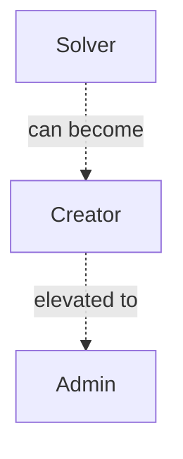

| Actor | Description | Permissions |
|-------|-------------|-------------|
| **Solver** | Challenge participant | Start sessions, submit answers, earn badges, browse scenarios |
| **Creator** | Scenario designer | Create scenarios, manage content, test locally, all solver permissions |
| **Admin** | Platform administrator | Approve scenarios, manage users, system config, all creator permissions |

---

## 1. Authentication & User Management

### Use Case Diagram

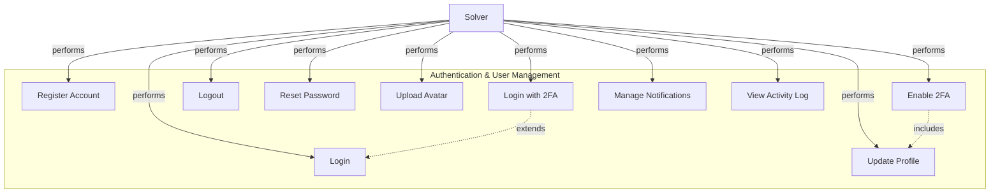

### Use Cases

| ID | Use Case | Actor | Description |
|----|----------|-------|-------------|
| UC1 | Register Account | Solver | Create new user account with email/password |
| UC2 | Login | Solver | Authenticate with credentials |
| UC3 | Login with 2FA | Solver | Two-factor authentication using TOTP |
| UC4 | Logout | Solver | End current session |
| UC5 | Reset Password | Solver | Request password reset via email |
| UC6 | Update Profile | Solver | Modify display name, bio, preferences |
| UC7 | Upload Avatar | Solver | Set profile picture |
| UC8 | Enable 2FA | Solver | Configure TOTP-based authentication |
| UC9 | Manage Notifications | Solver | Set notification preferences |
| UC10 | View Activity Log | Solver | See account activity history |

### Key Relationships

- **UC3 extends UC2**: 2FA is an optional enhancement to standard login
- **UC8 includes UC6**: Enabling 2FA modifies profile settings

---

## 2. Scenario Management (Creator)

### Use Case Diagram

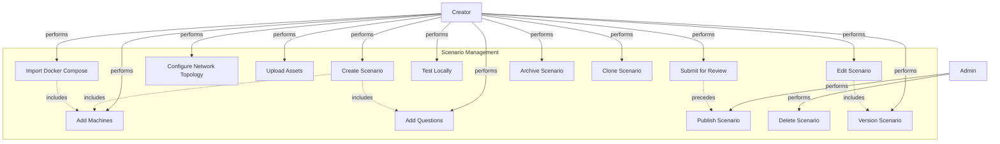

### Use Cases

| ID | Use Case | Actor | Description |
|----|----------|-------|-------------|
| UC11 | Create Scenario | Creator | Design new cybersecurity challenge (5-step wizard) |
| UC12 | Edit Scenario | Creator | Modify existing scenario details |
| UC13 | Add Machines | Creator | Configure container instances (attacker/victim/service) |
| UC14 | Configure Network Topology | Creator | Set up network groups and connectivity |
| UC15 | Add Questions | Creator | Create validation questions (6 types) |
| UC16 | Upload Assets | Creator | Add files, configs, flags to scenario |
| UC17 | Import Docker Compose | Creator | Auto-generate machines from compose file |
| UC18 | Test Locally | Creator | Deploy to local Docker for validation |
| UC19 | Submit for Review | Creator | Send scenario to admin approval queue |
| UC20 | Publish Scenario | Admin | Make scenario publicly available |
| UC21 | Archive Scenario | Creator | Hide scenario from public listing |
| UC22 | Delete Scenario | Admin | Permanently remove scenario |
| UC23 | Clone Scenario | Creator | Duplicate existing scenario as template |
| UC24 | Version Scenario | Creator | Create new version of published scenario |

### Question Types Supported

1. **Multiple Choice (MCQ)** - Single or multi-select
2. **Short Answer** - Free text with fuzzy matching
3. **True/False** - Binary choice
4. **Matching** - Pair items from two columns
5. **Ordering** - Arrange items in sequence
6. **Practical Task** - File/command output validation

---

## 3. Challenge Solving (Solver)

### Use Case Diagram

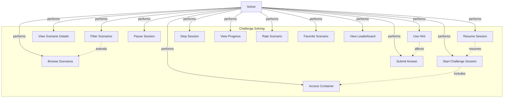

### Use Cases

| ID | Use Case | Actor | Description |
|----|----------|-------|-------------|
| UC25 | Browse Scenarios | Solver | View available challenges |
| UC26 | Filter Scenarios | Solver | Search by difficulty, category, tags |
| UC27 | View Scenario Details | Solver | See challenge description, requirements |
| UC28 | Start Challenge Session | Solver | Deploy environment and begin challenge |
| UC29 | Access Container | Solver | Connect via SSH/RDP/Web to machines |
| UC30 | Submit Answer | Solver | Provide answer for validation |
| UC31 | Use Hint | Solver | Get help (with point penalty) |
| UC32 | Pause Session | Solver | Temporarily stop environment |
| UC33 | Resume Session | Solver | Continue paused session |
| UC34 | Stop Session | Solver | End session and cleanup |
| UC35 | View Progress | Solver | See completion percentage and score |
| UC36 | Rate Scenario | Solver | Give feedback (1-5 stars) |
| UC37 | Favorite Scenario | Solver | Bookmark for quick access |
| UC38 | View Leaderboard | Solver | See rankings and high scores |

### Session Lifecycle

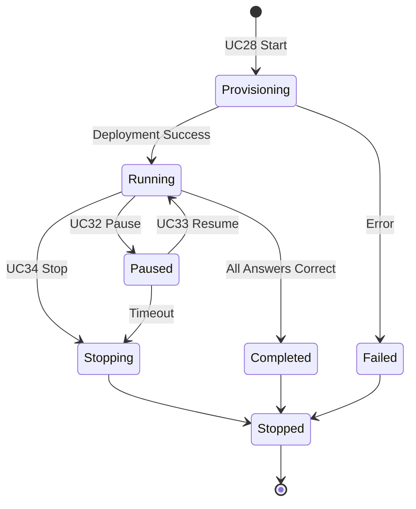

---

## 4. Admin Operations

### Use Case Diagram

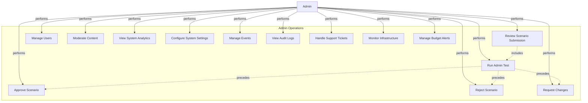

### Use Cases

| ID | Use Case | Actor | Description |
|----|----------|-------|-------------|
| UC39 | Review Scenario Submission | Admin | Examine pending scenario for approval |
| UC40 | Run Admin Test | Admin | Deploy and validate scenario functionality |
| UC41 | Approve Scenario | Admin | Publish scenario to public catalog |
| UC42 | Reject Scenario | Admin | Decline scenario with reason |
| UC43 | Request Changes | Admin | Ask creator to revise scenario |
| UC44 | Manage Users | Admin | Create, edit, disable user accounts |
| UC45 | Moderate Content | Admin | Remove inappropriate content |
| UC46 | View System Analytics | Admin | See usage stats, costs, performance |
| UC47 | Configure System Settings | Admin | Modify platform configuration |
| UC48 | Manage Events | Admin | Create, edit, monitor competitions |
| UC49 | View Audit Logs | Admin | Track all system activities |
| UC50 | Handle Support Tickets | Admin | Respond to user issues |
| UC51 | Monitor Infrastructure | Admin | Check AWS health, containers |
| UC52 | Manage Budget Alerts | Admin | Handle cost overruns |

### Admin Testing Workflow

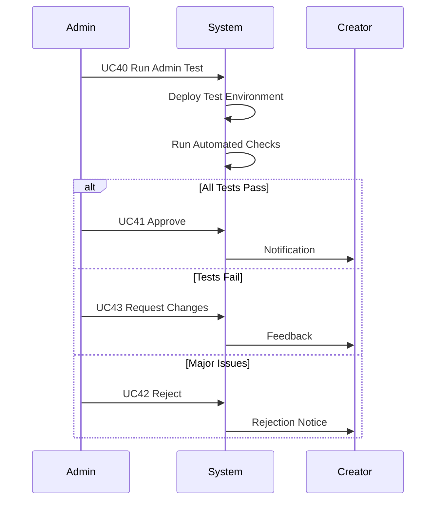

---

## 5. Event Management

### Use Case Diagram

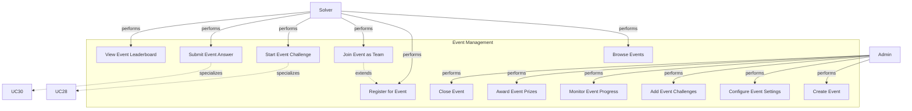

### Use Cases

| ID | Use Case | Actor | Description |
|----|----------|-------|-------------|
| UC53 | Browse Events | Solver | View upcoming and past events |
| UC54 | Register for Event | Solver | Sign up for competition |
| UC55 | Join Event as Team | Solver | Register entire team |
| UC56 | Start Event Challenge | Solver | Begin event-specific challenge |
| UC57 | Submit Event Answer | Solver | Answer tracked for leaderboard |
| UC58 | View Event Leaderboard | Solver | See rankings in real-time |
| UC59 | Create Event | Admin | Set up new competition |
| UC60 | Configure Event Settings | Admin | Set dates, rules, participants |
| UC61 | Add Event Challenges | Admin | Select scenarios for event |
| UC62 | Monitor Event Progress | Admin | Track participation and issues |
| UC63 | Award Event Prizes | Admin | Distribute badges/certificates |
| UC64 | Close Event | Admin | Finalize results and archive |

### Event Types

- **Individual Competition** - Solo participation
- **Team Competition** - Collaborative solving
- **Jeopardy-style** - Multiple challenges, point-based
- **Time-limited** - Fixed duration events
- **King of the Hill** - Continuous scoring

---

## 6. Team Collaboration

### Use Case Diagram

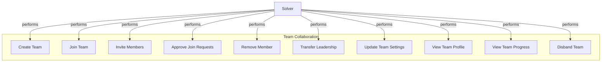

### Use Cases

| ID | Use Case | Actor | Description |
|----|----------|-------|-------------|
| UC65 | Create Team | Solver | Establish new team |
| UC66 | Join Team | Solver | Request to join existing team |
| UC67 | Invite Members | Solver | Send team invitations |
| UC68 | Approve Join Requests | Solver | Accept/reject applications |
| UC69 | Remove Member | Solver | Kick member from team |
| UC70 | Transfer Leadership | Solver | Assign new team leader |
| UC71 | Update Team Settings | Solver | Modify name, description, avatar |
| UC72 | View Team Profile | Solver | See team information |
| UC73 | View Team Progress | Solver | Track team achievements |
| UC74 | Disband Team | Solver | Delete team permanently |

---

## 7. Learning Paths & Gamification

### Use Case Diagram

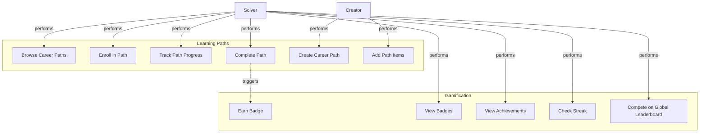

### Use Cases

| ID | Use Case | Actor | Description |
|----|----------|-------|-------------|
| UC75 | Browse Career Paths | Solver | Explore structured learning paths |
| UC76 | Enroll in Path | Solver | Start following a career path |
| UC77 | Track Path Progress | Solver | Monitor completion percentage |
| UC78 | Complete Path | Solver | Finish all path items |
| UC79 | Create Career Path | Creator | Design learning progression |
| UC80 | Add Path Items | Creator | Select scenarios for path |
| UC81 | Earn Badge | Admin | Automatic achievement award |
| UC82 | View Badges | Solver | See earned achievements |
| UC83 | View Achievements | Solver | Check milestones |
| UC84 | Check Streak | Solver | See consecutive days active |
| UC85 | Compete on Global Leaderboard | Solver | View platform-wide rankings |

### Badge Categories

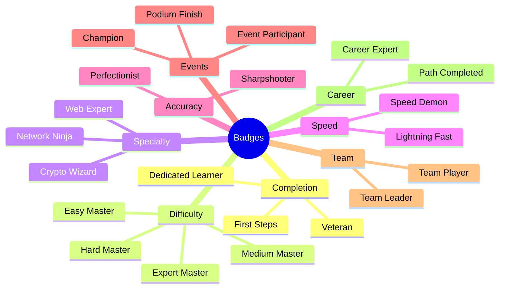

---

## 8. System Administration

### Use Case Diagram

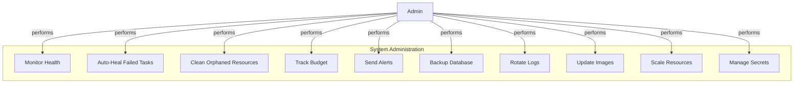

### Use Cases

| ID | Use Case | Actor | Description |
|----|----------|-------|-------------|
| UC86 | Monitor Health | Admin | Check ECS tasks, security groups, VPC |
| UC87 | Auto-Heal Failed Tasks | Admin | Restart stopped containers |
| UC88 | Clean Orphaned Resources | Admin | Remove abandoned tasks/SGs |
| UC89 | Track Budget | Admin | Calculate monthly costs |
| UC90 | Send Alerts | Admin | Notify admins of issues |
| UC91 | Backup Database | Admin | Daily database snapshots |
| UC92 | Rotate Logs | Admin | Archive old logs |
| UC93 | Update Images | Admin | Pull latest container images |
| UC94 | Scale Resources | Admin | Adjust capacity |
| UC95 | Manage Secrets | Admin | Update credentials |

### Monitoring Schedule

| Frequency | Use Cases |
|-----------|-----------|
| **Every 5 min** | UC86, UC87, UC88 |
| **Every 1 hour** | UC89, UC90 |
| **Daily 2 AM** | UC91, UC92 |
| **Weekly** | UC93 |
| **On-demand** | UC94, UC95 |

---

## Use Case Specifications

### UC28: Start Challenge Session (Detailed)

**Primary Actor**: Solver  
**Goal**: Deploy and access containerized challenge environment  
**Preconditions**: 
- User is authenticated
- Scenario is published
- User within concurrent session limit
- Budget available

**Main Success Scenario**:
1. User selects scenario from catalog
2. User clicks "Start Challenge"
3. System validates prerequisites
4. System creates session record (status: provisioning)
5. System deploys infrastructure:
   - If local: Docker containers
   - If cloud: AWS Fargate tasks
6. System configures networking and security groups
7. System waits for all containers/tasks to be healthy
8. System updates session status to "running"
9. System returns access credentials and gateway URL
10. User receives notification: "Environment Ready"
11. User accesses container via SSH/RDP/Web

**Alternative Flows**:
- **3a. Limit exceeded**: Show error, suggest stopping old sessions
- **5a. Deployment fails**: Mark session as failed, cleanup resources
- **6a. Network error**: Retry with exponential backoff
- **7a. Health check timeout**: Force stop and alert admin

**Postconditions**:
- Session record exists with status "running"
- Environment accessible via gateway
- Session timer started
- Cost tracking initiated

**Business Rules**:
- Max 3 concurrent sessions per user
- Session timeout: 3 hours (configurable)
- Auto-pause after 30 min idle
- Grace period before auto-stop: 2 hours

---

### UC40: Run Admin Test (Detailed)

**Primary Actor**: Admin  
**Goal**: Validate scenario functionality before approval  
**Preconditions**:
- Scenario submitted for review
- Admin has elevated permissions
- Test infrastructure available

**Main Success Scenario**:
1. Admin opens review queue
2. Admin selects pending scenario
3. Admin clicks "Test Scenario"
4. System creates test deployment record
5. System deploys scenario in test environment
6. System runs automated validation checks:
   - **Connectivity**: SSH/RDP/Web accessible
   - **Ports**: All exposed ports open
   - **Resources**: CPU/memory within limits
   - **Questions**: Auto-grading works correctly
   - **Network**: Machines can communicate as expected
7. System generates test report
8. System saves report to database
9. System displays results to admin
10. Admin reviews report
11. Admin makes approval decision

**Alternative Flows**:
- **6a. Connectivity fails**: Log error, continue other tests
- **6b. Auto-grading broken**: Flag as critical issue
- **8a. Deployment fails**: Mark test as failed, notify creator

**Postconditions**:
- Test report linked to scenario version
- Admin can make informed approval decision
- Test environment cleaned up

**Business Rules**:
- Test timeout: 30 minutes
- Automatic cleanup after test
- Test results stored for 90 days

---

### UC81: Earn Badge (Detailed)

**Primary Actor**: Admin  
**Trigger**: User completes action (e.g., finish challenge)  
**Goal**: Award achievements based on criteria

**Main Success Scenario**:
1. User completes action (e.g., session completed)
2. System checks badge requirements
3. For each badge category:
   - **Completion**: Check challenge count
   - **Difficulty**: Check difficulty-specific count
   - **Specialty**: Check category-specific count
   - **Speed**: Check completion time
   - **Accuracy**: Check score percentage
   - **Streak**: Check consecutive days
4. System identifies eligible badges
5. For each badge:
   - Check if user already has badge
   - If not, create user_badge record
   - Create notification
   - Send WebSocket event to frontend
6. Frontend displays badge animation
7. System checks for milestone badges (e.g., 5 badges = Collector)
8. If milestone reached, award meta-badge

**Alternative Flows**:
- **5a. Badge already earned**: Skip award
- **6a. User offline**: Queue notification for next login

**Postconditions**:
- Badge(s) awarded and visible in user profile
- Notification sent
- User notified in real-time (if online)

**Business Rules**:
- Badges are permanent (cannot be removed)
- Some badges are one-time only
- Team badges awarded separately

---

## System Context Diagram

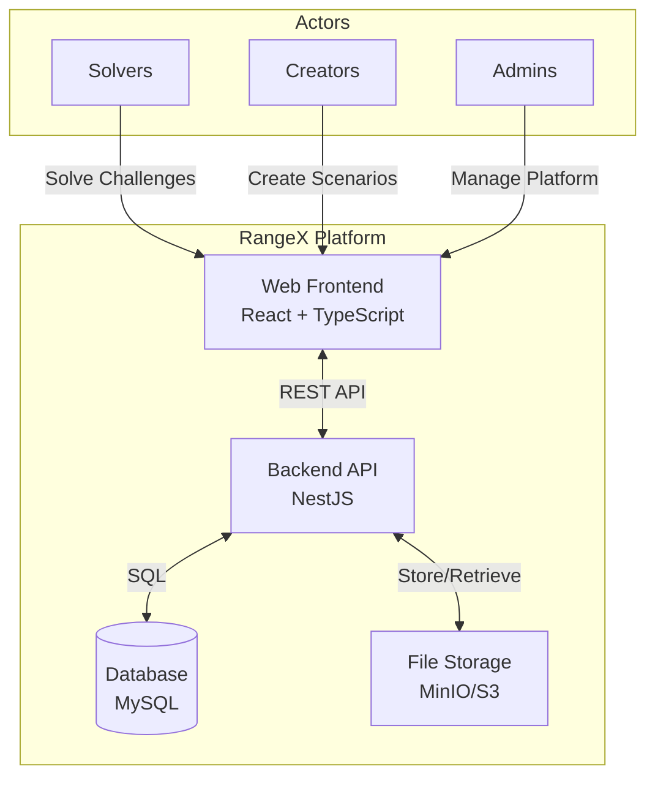

---

## Use Case Summary

### By Actor

| Actor | Use Cases Count | Primary Responsibilities |
|-------|----------------|--------------------------|
| **Guest** | 3 | Browse, Register, Login |
| **Solver** | 21 | Challenges, Learning, Competition |
| **Creator** | 17 | Scenario Design, Testing, Management |
| **Admin** | 24 | Approval, Moderation, Configuration |
| **System** | 10 | Automation, Monitoring, Maintenance |
| **TOTAL** | **95 Use Cases** | Full Platform Coverage |

### By Category

| Category | Use Cases | Complexity |
|----------|-----------|------------|
| Authentication | 10 | Low-Medium |
| Scenario Management | 14 | High |
| Challenge Solving | 14 | Medium-High |
| Admin Operations | 14 | Medium |
| Event Management | 12 | Medium |
| Team Collaboration | 10 | Low-Medium |
| Learning & Gamification | 11 | Medium |
| System Administration | 10 | High |

---

## Relationships Summary

### Include Relationships
- UC11 (Create Scenario) **includes** UC13 (Add Machines)
- UC11 (Create Scenario) **includes** UC15 (Add Questions)
- UC28 (Start Session) **includes** UC29 (Access Container)
- UC39 (Review Submission) **includes** UC40 (Run Test)

### Extend Relationships
- UC3 (Login with 2FA) **extends** UC2 (Login)
- UC26 (Filter Scenarios) **extends** UC25 (Browse Scenarios)
- UC55 (Join Event as Team) **extends** UC54 (Register for Event)

### Generalization
- UC56 (Start Event Challenge) **specializes** UC28 (Start Session)
- UC57 (Submit Event Answer) **specializes** UC30 (Submit Answer)

---

## 📊 Metrics & KPIs

### Use Case Success Metrics

| Use Case | Success Metric | Target |
|----------|----------------|--------|
| UC1 (Register) | Completion rate | > 80% |
| UC28 (Start Session) | Deploy time | < 60s |
| UC30 (Submit Answer) | Validation time | < 500ms |
| UC40 (Admin Test) | Auto-pass rate | > 70% |
| UC81 (Earn Badge) | Award latency | < 1s |

### Platform Health

- **Active Users**: Daily/Monthly active count
- **Session Success Rate**: Completed / Started
- **Scenario Quality**: Approval rate, average rating
- **Infrastructure Uptime**: 99.9% target
- **Response Time**: P95 < 2s

---

## 🔒 Security Considerations

### Authentication (UC1-UC10)
- Rate limiting on login attempts
- Password strength enforcement
- 2FA recommended for admins
- Session timeout after inactivity

### Authorization
- Role-based access control (RBAC)
- Resource ownership validation
- Admin actions logged to audit trail

### Infrastructure (UC28, UC40)
- Network isolation via security groups
- No public IPs on containers
- Gateway proxy for all access
- Encrypted credentials

---

## 🎯 Future Use Cases

### Planned Features

| ID | Use Case | Actor | Priority |
|----|----------|-------|----------|
| UC96 | AI-Powered Hints | Solver | Medium |
| UC97 | Peer Review Scenarios | Creator | Low |
| UC98 | Live Streaming Session | Solver | Low |
| UC99 | Scenario Marketplace | Creator | High |
| UC100 | Custom Branding (White-label) | Admin | Medium |
| UC101 | Multi-language Support | All | High |
| UC102 | Mobile App Access | Solver | Medium |
| UC103 | Scenario Analytics Dashboard | Creator | High |
| UC104 | Automated Difficulty Rating | Admin | Medium |
| UC105 | Integration with LMS | Admin | Low |

---

## 📝 Conclusion

This comprehensive use case documentation covers **95 use cases** across **8 major categories** involving **5 actor types**. The diagrams and specifications provide a complete view of:

- **User Interactions**: How different actors engage with the system
- **System Behavior**: Automated processes and background jobs
- **Business Logic**: Rules, constraints, and workflows
- **Integration Points**: External systems and services

**Use this document for**:
- Requirements validation
- Feature planning and prioritization
- Developer onboarding
- Testing scenario creation
- Stakeholder communication

---

**Last Updated**: January 7, 2026  
**Total Use Cases**: 95  
**Total Actors**: 3 (Solver, Creator, Admin)  
**Status**: ✅ Production Ready
